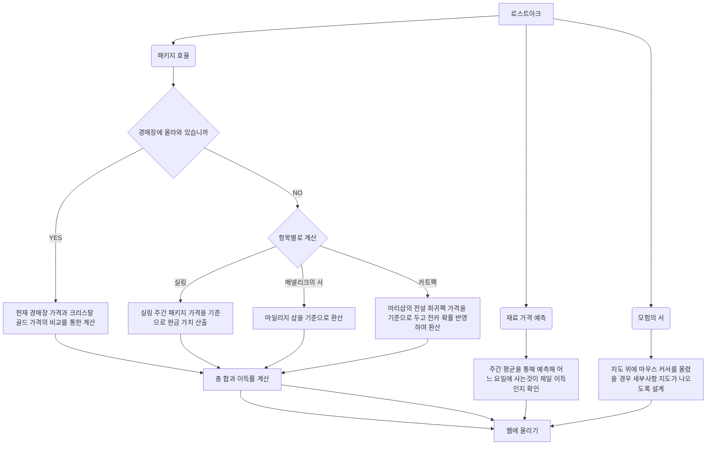

# 로스트 아크를 하면서 불편한 점을 웹에서 해결할 수 있을까?

로스트아크를 하면서 바로 알기 힘든 것들을 정리해주는 웹사이트가 있으면 좋지 않을까 생각이 들게 되어 사이트를 제작하려 합니다.

주로 제가 타겟으로 하는 파트들은 로스트 아크에서 내는 **패키지 효율**, **모험의 서**, **캐릭마다 너프나 버프**, **강화 재료 가격 예측** 등을 하려합니다.

## 패키지 효율

LostArk API를 사용하여 경매장 내에 패키지 내에 있는 아이템들의 가격을 측정하여 효율 분석하기

## 모험의서

모험의서 지도에 마우스를 올리면 해당 맵에 자세하게 표시되게 하기

## 캐릭마다 너프나 버프

로스트 아크의 공지사항을 요약 모델이나 통째로 올리는 것으로 생각 중

## 강화 재료 가격 예측

경매장의 이전 가격 데이터들을 딥러닝 모델로 돌려 예측해보기
